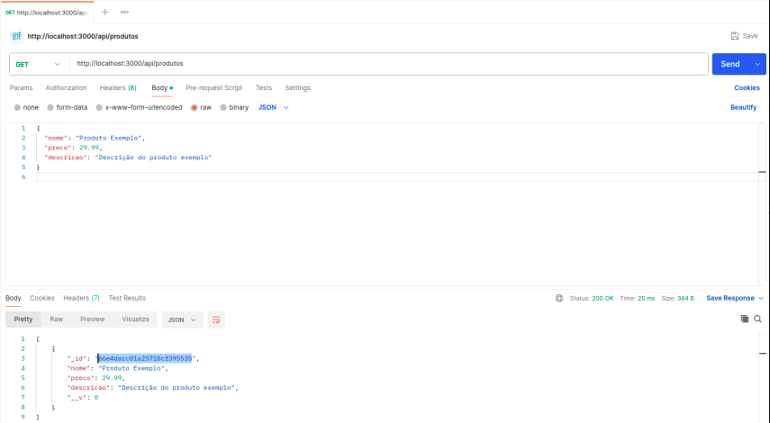

# Checkpoint 4 - Microsserviços

## Instruções para rodar a aplicação:

- [ ] 1º digite o comando git clone:
```
git clone https://github.com/joaotuneli56/checkpoint4.git
```

- [ ] 2º Entre no projeto:
```
cd checkpoint4
``` 

- [ ] 3º Separe o dois terminais um para subir a imagem e outro para rodar o node

- [ ] 5º No terminal do node rode os seguintes comandos separadamente:
```
npm install express mongoose

npm start
``` 

- [ ] 6º Rode a imagem do docker:
```
docker run -d --name mongo-container -p 27017:27017 -e MONGO_INITDB_ROOT_USERNAME=admin -e MONGO_INITDB_ROOT_PASSWORD=adminpassword -v mongo-data:/data/db mongo:latest
```

## Evidencias quais metodos HTTP:

- **GE0T**



- **POST**


- **PUT**


